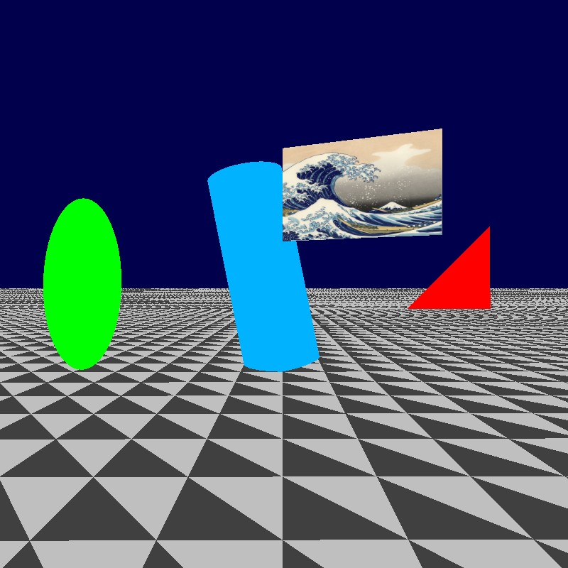
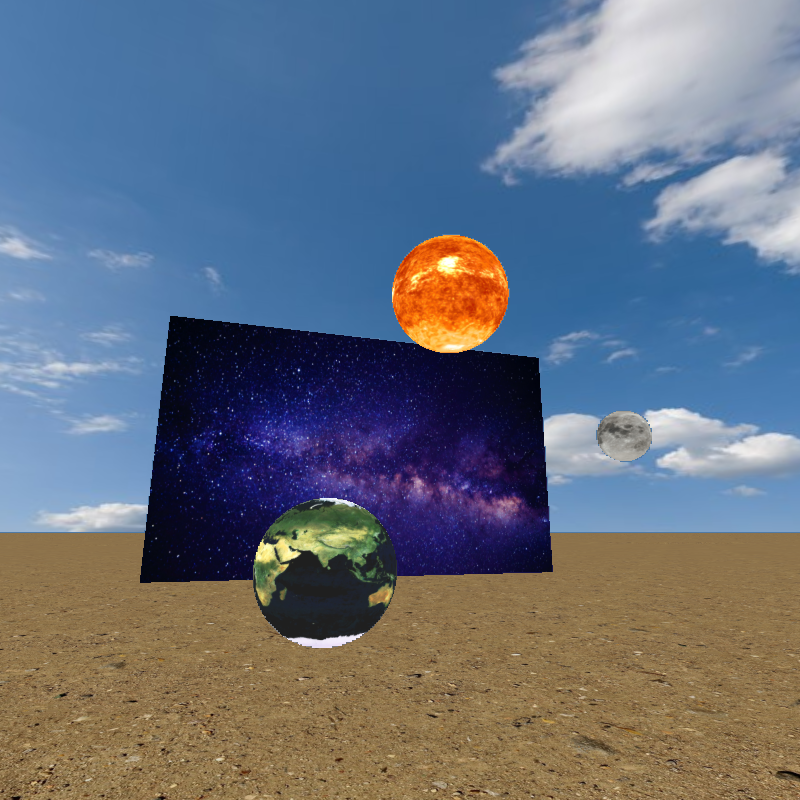
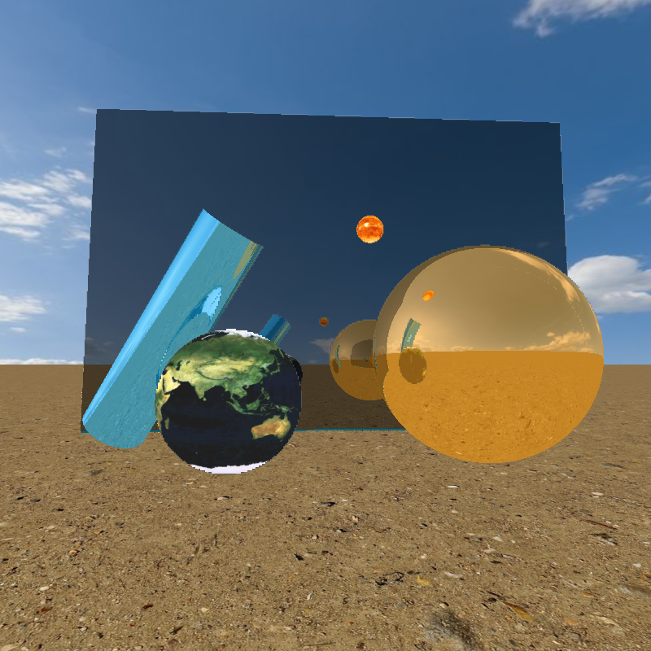
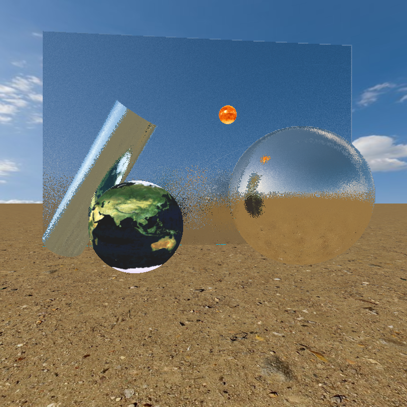
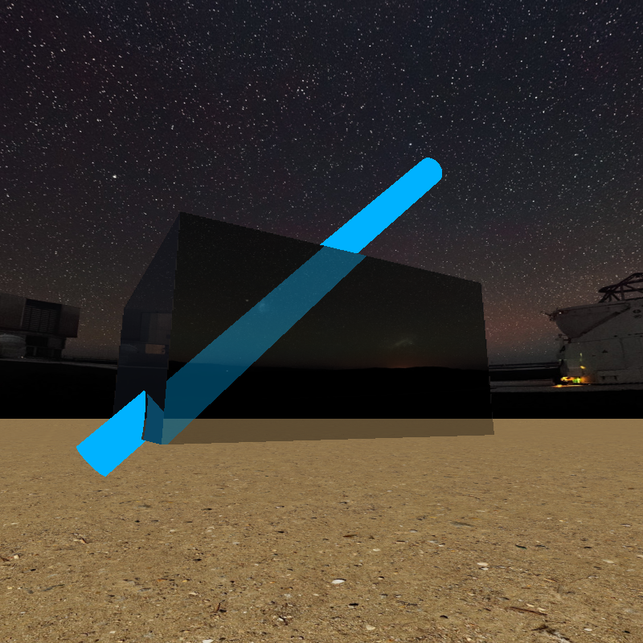
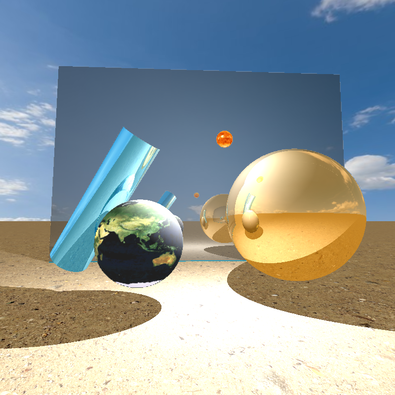
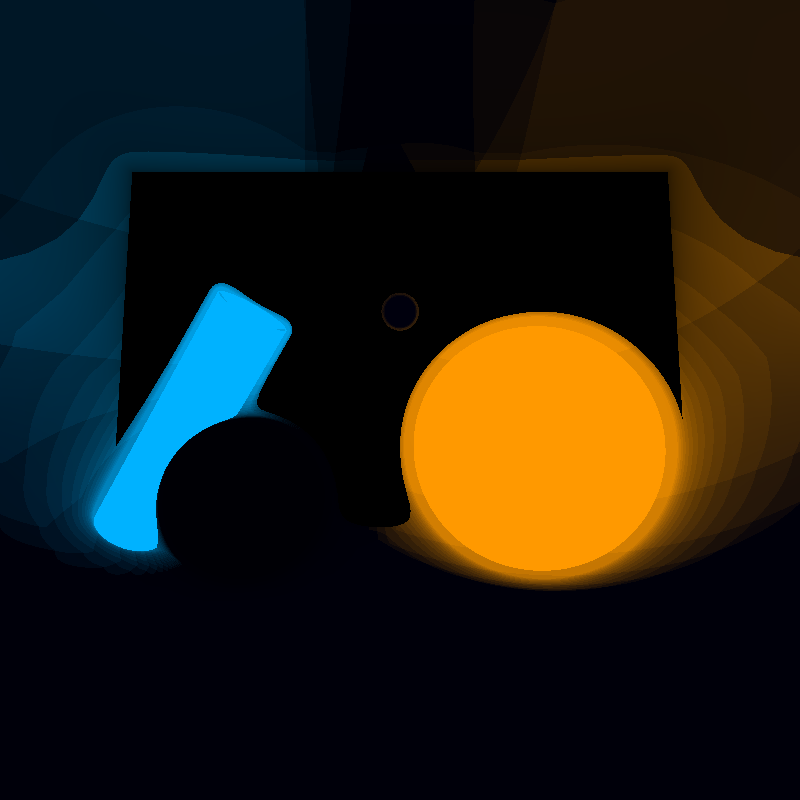

# My TIPE

## Short Presentation

The goal of this project is to render 3D objects on a screen. 

I uses raymarching to render primitives (sphere, cylinder and rectangle). I'm able to render light, shadow and mirrors. 

## How to Install

This simulation uses Processing. You can download the Processing application [here](https://processing.org/download). The file `TIPE.pde` is the layout and manage UI. The file `shader.glsl` render the screen with `TIPE.pde` parameters.

Keyboard actions :
- `ESC` : exit
- `Enter` : take a screenshot
- `Arrows` : move camera
- `ZQSD` : change orientation
- `1-9` : change the scene
- `l` and `m` : change the scene
- `:` and `=` : change the value of a parameter depending of the scene
- `,` : change display mode : Simple raytracing, raytracing with light or raymarching (slow)
- `;` : change light mode : ambient light, ambiente and objects light, only objects light
- `n` : change background : day or night

## Features

This is a graphic engine on GPU. The engine use Ray Tracing and Ray Marching.

Features :
- Three primitives : sphere, cylinder and rectangle

- Textures for primitives

- Reflexion

- Blur

- Refraction

- Light & Shadow

- Ray Marching

