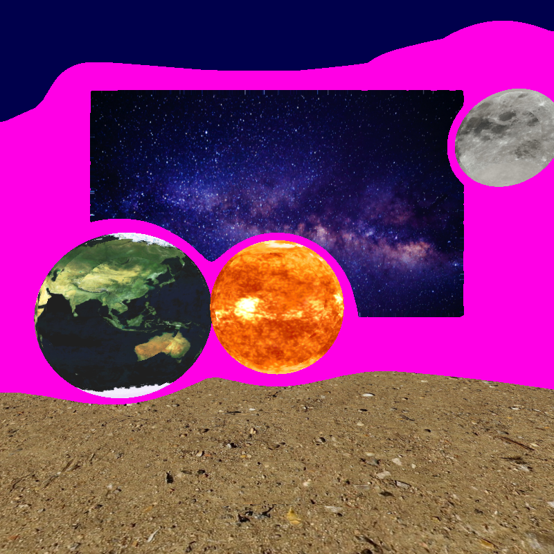
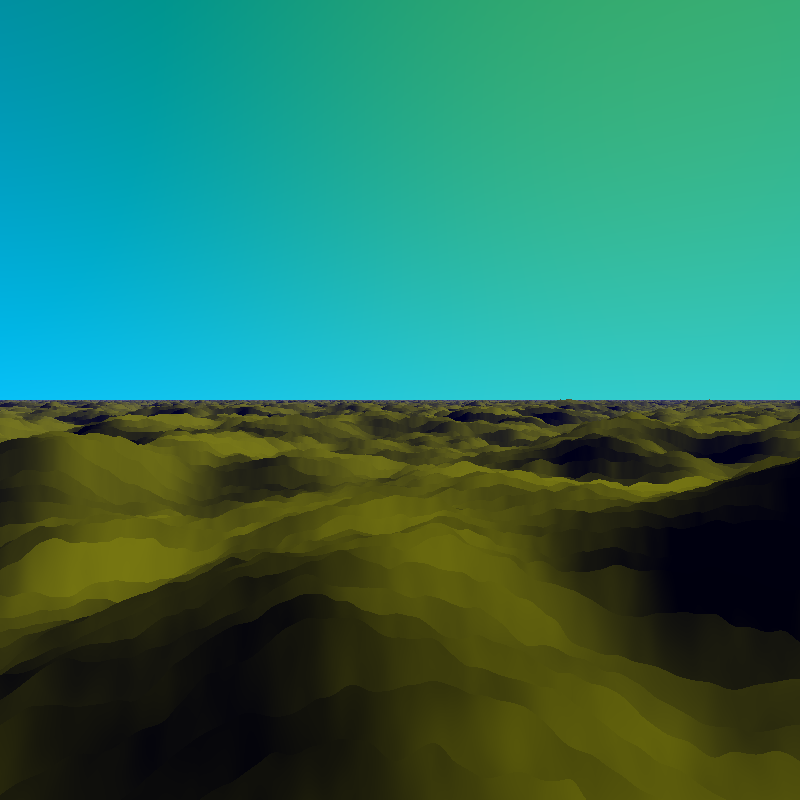

# My TIPE

## Short Presentation

The goal of this project is to render 3D objects on a screen. 

I uses raymarching to render primitives (sphere, cylinder and rectangle). I'm able to render light, shadow and mirrors. 

## How to Install

This simulation uses Processing for UI and GLSL to render. You can download the Processing application [here](https://processing.org/download). The file `TIPE.pde` is the layout and manage UI. The file `shader.glsl` render the screen with `TIPE.pde` parameters.

Keyboard actions :
- `ESC` : exit
- `Enter` : take a screenshot
- `Arrows` : move camera
- `ZQSD` : change orientation
- `1-9` : change the scene
- `l` and `m` : change the scene
- `:` and `=` : change the value of a parameter depending of the scene
- `,` : change display mode : Simple raytracing, raytracing with light or raymarching (slow)
- `;` : change light mode : ambient light, ambiente and objects light, only objects light
- `n` : change background : day or night


## Features

This is a graphic engine on GPU. The engine use Ray Tracing and Ray Marching.

Features :
- Three primitives : sphere, cylinder and rectangle <br>


- Textures for primitives <br>


- Reflexion <br>


- Blur <br>


- Refraction <br>


- Light & Shadow <br>


- Ray Marching <br>
Pink color is where the algorithm does not converge <br> 


- Terrain Generation <br>



You can find more pictures in the pictures folder. 

## Basic functionment

Here is a pseudo-code algorithm explaining the functionment of the raymarching :

```Python
def calc_color(R = None):

    if R == None:
        R = Ray( Origin = camera, Direction = pixel)

    Obj = closest_intersection(R, Objects_list)

    if Obj.reflexion:
        R = reflect_ray()
        reflect_color = calc_color(R)

    if Obj.refraction:
        R = refract_ray()
        refract_color = calc_color(R)


    return Obj.color + reflect_color + refract_color
```

And here is the algorithm for ray marching :

```python
def Ray_Marching():
    P = camera.position
    u = Ray(Origin = camera, Direction = pixel)
    v = normalize(u)

    while True:
        d = SDF(P)
        if d < 0.001: break
        P += v * d

    obj = closest_object(P)

    return obj.color
```